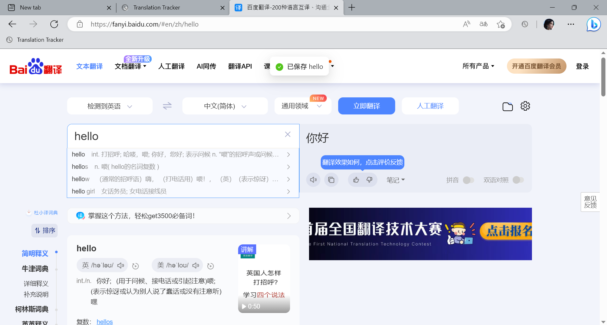
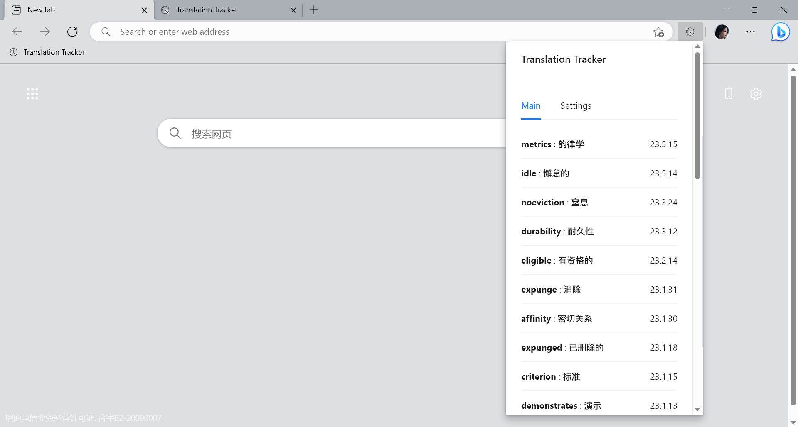
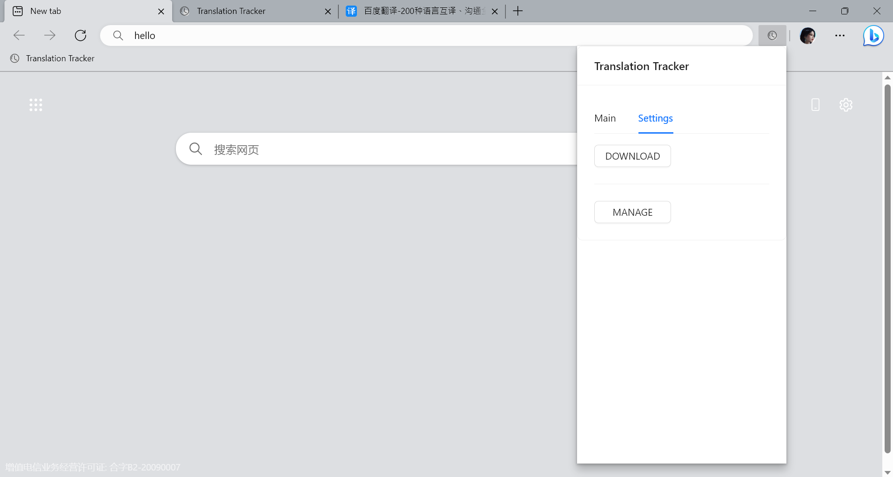
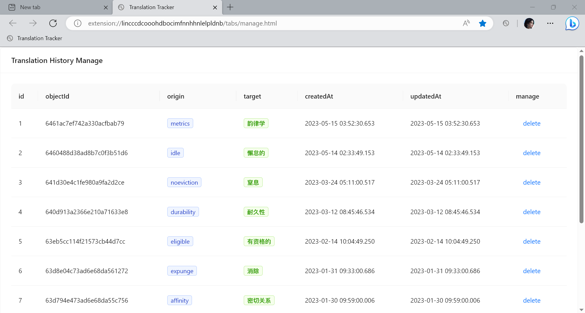

This is a [Plasmo extension](https://docs.plasmo.com/) project bootstrapped
with [`plasmo init`](https://www.npmjs.com/package/plasmo).

## Info

This is a simple Chrome extension that records translation history.

Simply **paste** the word or sentence into the text area, and both the original word/sentence and its translated version
will be automatically stored in the cloud platform.

### Feature

* automatically save to cloud storage
* export records as local file
* easy manage in web tab

More features will be supported in the future.

### Support

* [fanyi.baidu.com](https://fanyi.baidu.com)
* [fanyi.youdao.com](https://fanyi.youdao.com)
* [fanyi.qq.com](https://fanyi.qq.com)
* [cn.bing.com/translator](https://cn.bing.com/translator)

More webs will be added

### Screen Shot

1. Using
   

2. Main
   

3. Setting
   

4. Manage tab
   

## Getting Started

1. First you hava to register a new count in [Leancloud](https://leancloud.app/) for storing the data
2. create a LeanStorage app
3. `Data storage -> data -> create class`, sames to `src/class/TrRecord.tsx`
4. Rename the `config.sample.tsx` to `config.tsx`
5. Get `id`, `key` and `serviceUrl` from the Leancloud and set them into the `config.tsx`

## Run the development server:

```bash
pnpm dev
# or
npm run dev
```

Open your browser and load the appropriate development build. For example, if you are developing for the chrome browser,
using manifest v3, use: `build/chrome-mv3-dev`.

You can start editing the popup by modifying `popup.tsx`. It should auto-update as you make changes. To add an options
page, simply add a `options.tsx` file to the root of the project, with a react component default exported. Likewise to
add a content page, add a `content.ts` file to the root of the project, importing some module and do some logic, then
reload the extension on your browser.

For further guidance, [visit our Documentation](https://docs.plasmo.com/)

## Making production build

Run the following:

```bash
pnpm build
# or
npm run build
```

This should create a production bundle for your extension, ready to be zipped and published to the stores.

## Install

See the [doc](https://docs.plasmo.com/#loading-the-extension-in-chrome)

## Submit to the webstores

The easiest way to deploy your Plasmo extension is to use the built-in [bpp](https://bpp.browser.market) GitHub action.
Prior to using this action however, make sure to build your extension and upload the first version to the store to
establish the basic credentials. Then, simply
follow [this setup instruction](https://docs.plasmo.com/workflows#submit-your-extension) and you should be on your way
for automated submission!
